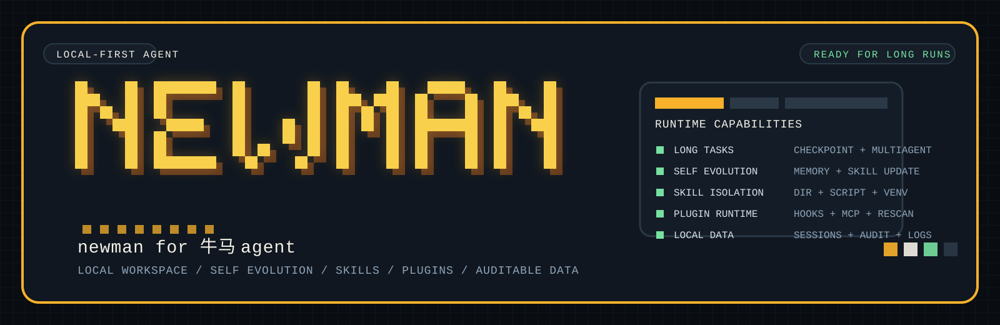

<p align="center">
  
</p>

<p align="center">
  <strong>Newman</strong> 是一个给牛马干活的本地优先 AI Agent 运行时与工作台。
  它不只负责聊天，而是围绕本地工作区、长任务推进、Skill / Plugin 生态和可审计数据目录，把能持续交付和自进化的 Agent 基线做出来。
</p>

# Newman

## Newman for 牛马 Agent

Newman 面向真实工作流：读文件、跑工具、拆长任务、调用子 Agent、沉淀记忆、自我进化、更新技能、接入插件。仓库里包含 FastAPI 后端、React 工作台，以及围绕 `skills/`、`plugins/`、`backend_data/` 组织的本地优先运行时。

它适合这几类场景：

- 任务不是一句话解决，而是需要连续推进、持续补充上下文。
- 数据和配置更希望留在本机或当前工作区，不想全部托管到远端黑盒。
- 希望 Agent 的经验、技能和插件能力可以逐步沉淀，而不是每轮会话都从零开始。

## 功能亮点

| 能力 | 说明 |
| --- | --- |
| 长任务 | 支持多阶段推进、上下文压缩、checkpoint 延续和 `multiagent` 子代理协作，适合持续跑任务而不是一次性问答。 |
| 自进化 | 把每次真实任务中的有效经验自动沉淀为下次可用的记忆和 skill，让 Newman 越用越贴近你的工作方式，同时保留 diff、快照和回滚记录。 |
| Skill 隔离 | 每个 skill 都是独立目录，能带 `SKILL.md`、脚本、模板、参考资料，Python 依赖还能走 skill-local `.venv`。 |
| 插件能力 | `plugins/` 支持 `plugin.yaml`、hooks、内嵌 MCP server、启停、重扫和插件内 skill 自动发现。 |
| 本地化数据 | 会话、记忆、审计、自进化日志、知识库、调度和渠道状态默认都落在 `backend_data/`，数据位置清晰、方便备份。 |
| 可治理 | 支持 Linux 原生沙箱、路径权限、审批策略和运行时配置热重载，适合需要边界和可追踪性的场景。 |

## 自进化：越干活，越懂活

Newman 的自进化不是简单的“记住聊天记录”，而是把一次次任务里的可复用经验沉淀进本地运行时。它会在会话结束或长会话累计到一定轮次后，后台复盘刚刚发生的任务，提取稳定经验，并判断是否需要更新对应 skill。

这套机制重点解决一个问题：Agent 不应该每次都像新人一样重新摸索你的项目、工具链和偏好。Newman 会把“这次踩过的坑”“这类任务的正确流程”“某个 skill 应该补充的执行约束”变成下次能直接使用的能力。

| 自进化能力 | 说明 |
| --- | --- |
| 自动复盘 | 新 session 创建时总结上一个非空 session；长会话每累计一定 user turn 后做增量总结。 |
| 经验沉淀 | 将高价值、可复用的经验写入 `backend_data/memory/MEMORY.md`，避免重复解释同一类问题。 |
| Skill 变强 | 在允许范围内更新 `skills/**` 或插件内 skill 的 `SKILL.md`、脚本、模板和参考资料。 |
| 证据驱动 | 自进化输入包含消息范围、checkpoint、当前 memory、skill 列表和近期 evolution 摘要，减少凭空改写。 |
| 可审计 | 每次 evolution run 都记录触发来源、变更摘要、diff、验证结果和错误信息。 |
| 可回滚 | 文件变更前保存快照；skill 验证失败会自动回滚，前端 Evolution Log 也支持事后回滚。 |
| 有边界 | 默认不会自动改权限、系统 prompt、后端/前端代码、沙箱策略或安装高权限插件。 |

最终效果是：Newman 会从“能调用工具的 Agent”，逐步变成“知道这台机器、这个项目、这些工作流该怎么干活的 Agent”。

## 项目结构

| 路径 | 作用 |
| --- | --- |
| `backend/` | FastAPI 后端、运行时、工具、沙箱、自进化、plugin / skill runtime。 |
| `frontend/` | React + Vite 工作台。 |
| `backend_data/` | 本地运行期数据目录，默认不提交版本库。 |
| `plugins/` | 插件目录，支持插件内 skills、hooks 和 MCP 配置。 |
| `skills/` | 工作区级 skill 目录。 |
| `scripts/dev/` | 本地开发启动、停止、状态检查脚本。 |
| `docs/` | API、设计文档、机制说明。 |

### 本地数据默认落盘

`backend_data/` 下默认会看到这些目录：

- `sessions/`：会话和消息记录
- `memory/`：`Newman.md`、`USER.md`、`MEMORY.md`、`SKILLS_SNAPSHOT.md`
- `audit/`：审计信息
- `evolution/`：自进化 run、快照、diff
- `knowledge/`、`chroma/`：知识文档、解析产物和向量索引
- `scheduler/`：定时任务与告警
- `channels/`：渠道 webhook 相关状态

## 部署指导

> 新机器或稳定运行优先走 Docker；需要改代码、联调或看运行日志时优先走本地开发。

### 方案一：Docker 部署

1. 准备容器环境变量。

```bash
cd /path/to/newman
cp .env.docker.example .env.docker
```

至少补齐这些配置：

- `NEWMAN_MODELS_PRIMARY_ENDPOINT`
- `NEWMAN_MODELS_PRIMARY_API_KEY`
- `NEWMAN_MODELS_MULTIMODAL_ENDPOINT`
- `NEWMAN_MODELS_MULTIMODAL_API_KEY`

2. 构建并启动。

```bash
cd /path/to/newman
docker compose build
docker compose up -d
```

3. 默认访问地址。

- Frontend: `http://127.0.0.1:17775`
- Backend API: `http://127.0.0.1:18005`
- Backend Docs: `http://127.0.0.1:18005/docs`

4. 常用运维命令。

```bash
cd /path/to/newman
docker compose ps
docker compose logs -f backend
docker compose logs -f frontend
docker compose logs -f postgres
docker compose down
docker compose up -d --build
```

5. 自定义外部端口时可以直接覆盖环境变量。

```bash
cd /path/to/newman
NEWMAN_FRONTEND_PORT=7775 NEWMAN_BACKEND_PORT=8005 docker compose up -d --build
```

Docker 模式注意事项：

- 容器内访问宿主机服务时，不要写 `127.0.0.1`，应改用 `host.docker.internal`。
- 后端会挂载 `backend_data/`、`plugins/`、`skills/`、`outputs/` 和 `backend/tools/`，便于保留本地数据和扩展能力。
- Docker 默认对外暴露的是 `17775 -> 80` 和 `18005 -> 8005`。

### 方案二：本地开发部署

1. 创建并进入 Conda 环境。

```bash
cd /path/to/newman
conda env create -f environment.yml
conda activate newman
```

2. 安装前端依赖。

```bash
cd /path/to/newman/frontend
npm install
```

3. 准备运行时环境变量。

```bash
cd /path/to/newman
cp .env.example .env
```

4. 启动整套服务。

```bash
cd /path/to/newman
conda activate newman
./scripts/dev/start_services.sh
```

默认端口：

- Frontend: `http://127.0.0.1:7775`
- Backend API: `http://127.0.0.1:8005`
- Backend Docs: `http://127.0.0.1:8005/docs`
- PostgreSQL: `127.0.0.1:65437`

常用脚本：

```bash
cd /path/to/newman
./scripts/dev/status_services.sh
./scripts/dev/restart_services.sh
./scripts/dev/stop_services.sh
./scripts/dev/start_postgres.sh
./scripts/dev/stop_postgres.sh
```

说明：

- `environment.yml` 会创建名为 `newman` 的环境，并按开发模式安装 `backend/`。
- 这些脚本应在宿主机 shell 里运行，不适合在 PID namespace 沙箱里直接控制主机服务。

### 配置约定

Newman 的配置优先级如下：

1. 环境变量
2. `~/.newman/config.yaml`
3. 项目根目录 `newman.yaml`
4. `backend/config/defaults.yaml`

部署时通常这样分工：

- `newman.yaml`：项目级部署配置
- `.env` / `.env.docker`：模型、密钥、DSN、endpoint 这类敏感或易变配置
- `backend/config/defaults.yaml`：代码内置基线，不直接按环境改

一个最常见的启动前检查清单：

- `newman.yaml` 是否存在并符合当前环境
- `.env` 或 `.env.docker` 是否填入真实模型配置
- PostgreSQL 或 Docker 容器是否正常
- `GET /healthz` 是否返回 `ok: true`

### 飞书接入

Newman 的飞书接入分两条能力线：

- 飞书给 Newman 发消息：走官方 Python Channel SDK，适合内网部署，只需要 Newman 主动出站连接飞书。
- Newman 主动操作飞书：走 `feishu-cli` 插件复用官方 `lark-cli` Agent Skills。

飞书 -> Newman 的最小配置：

```yaml
# newman.yaml
channels:
  feishu:
    enabled: true
    transport: "channel_sdk"
    domain: "https://open.feishu.cn"
    default_turn_approval_mode: "auto_allow"
    require_mention_in_group: true
    allowed_chat_ids: []
    allowed_user_open_ids: []
    reply_timeout_seconds: 20
    dedup_ttl_seconds: 600
```

敏感值放 `.env` 或 `.env.docker`：

```dotenv
NEWMAN_CHANNELS__FEISHU__APP_ID=cli_xxx
NEWMAN_CHANNELS__FEISHU__APP_SECRET=your_feishu_app_secret
```

飞书开放平台侧需要准备：

- 创建自建应用并启用机器人能力。
- 事件订阅选择“使用长连接接收事件”。
- 订阅 `im.message.receive_v1`。
- 开通接收消息、发送消息所需权限，并发布/安装应用到目标企业或测试范围。

验证接口：

```bash
curl http://127.0.0.1:8005/api/channels/feishu/setup/status
curl -X POST http://127.0.0.1:8005/api/channels/feishu/setup/validate
```

Newman -> 飞书的最小准备：

```bash
npx @larksuite/cli@latest install
lark-cli config init --new
lark-cli auth login --recommend
lark-cli auth status
```

Docker 部署已挂载宿主机 `~/.lark-cli` 和 `~/.local/share/lark-cli`；如果要让 Newman 默认给固定飞书用户发 IM，可在 `.env` / `.env.docker` 设置 `NEWMAN_LARK_DEFAULT_IM_USER_ID`。

## 相关文档

- [API 文档](docs/Newman_API_v1.md)
- [自进化机制](docs/self_evolution.md)
- [多代理设计](docs/newman_multiagent_design.md)
- [飞书接入配置清单](docs/feishu_setup.md)
- [飞书入站 Channel 设计](docs/feishu_inbound_channel_design.md)
- [飞书 CLI Channel 接入设计](docs/feishu_cli_channel_design.md)
- [Plugin Runtime](backend/plugin_runtime/README.md)
- [Skill Runtime](backend/skill_runtime/README.md)
